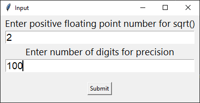
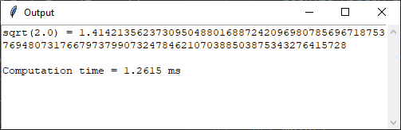

# Square root to n digits of precision
Python implementations of numerical methods to find the square root of an input floating point number to an arbitrary precision.

Includes a GUI dialog box to enter the input number and precision. 
<p align="center" width="100%">
  
</p>
<br>  
The output is displayed in scrollable text box that can be highlighted and copied.<br>
<br>
<p align="center" width="100%">
  
</p>
<br>

## Table of Contents
- [Prerequisites](#prerequisites-heading)
- [Dependencies](#dependencies-heading)
- [Usage](#usage-heading)
- [Bisection vs Newton–Raphson Methods](#bisection-vs-newton-raphson-heading)

<a name="prerequisites-heading"></a>
## Prerequisites
Python 3 (tested in version 3.12.2)

<a name="prerequisites-heading"></a>
## Dependencies
There are no external dependencies needed for these routines. They only use built-in Python modules and packages, such as the [tkinter](https://docs.python.org/3/library/tkinter.html) package and the [decimal](https://docs.python.org/3/library/decimal.html) module.

<a name="usage-heading"></a>
## Usage
### sqrt_bisection.py
The Bisection method can be ran directly in the console with  
```console
python sqrt_bisection.py
```

### sqrt_newton_raphson.py
The Newton–Raphson method can be ran directly in the console with  
```console
python sqrt_newton_raphson.py
```
<a name="bisection-vs-newton-raphson-heading"></a>
## Bisection vs Newton-Raphson Methods
Newton's method is relatively faster than the Bisection method because the convergence rate of the Bisection method is linear and Newton's method is quadratic.  

However, binary search is less sensitive to the initial guess and is suitable for functions where the derivative is not easily computable or when the function is not differentiable.
